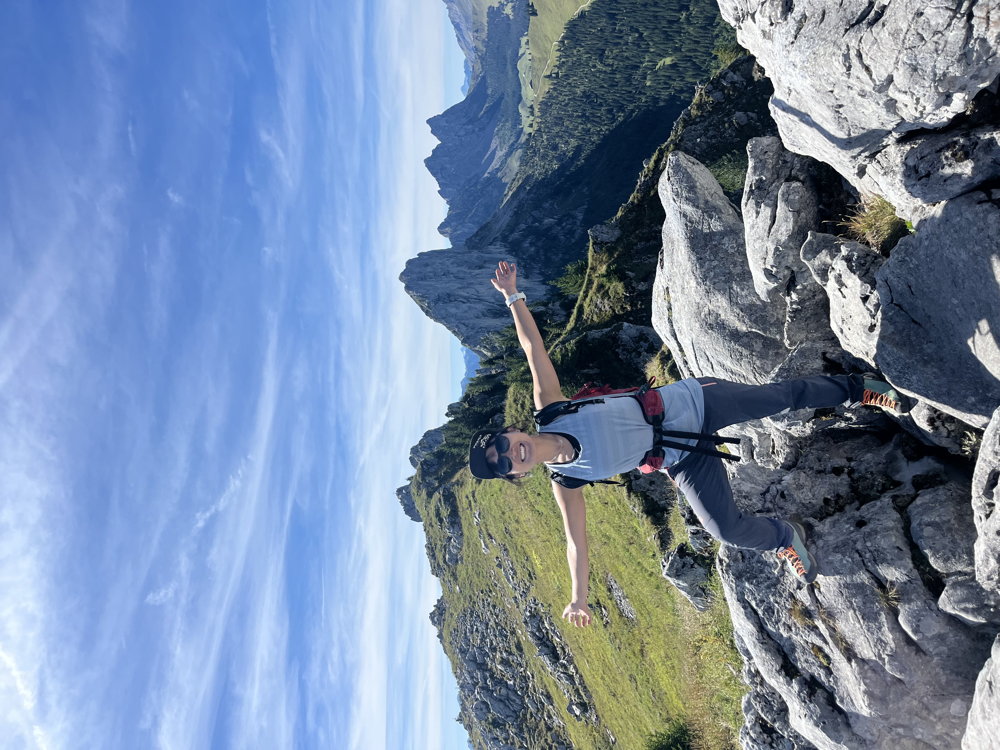

# Oh-hyeon's Personal Page

  
  

  
Hi, I'm Oh-hyeon, a <a href="korea/index.md">Korean</a> living in <a href="switzerland/index.md">Switzerland</a>. I'm an industrial ML/AI developer with a background in computational neuroscience.

  

  At work, I develop and research ML/AI systems that support product development across chemistry, medical imaging, computer vision, and tabular data. I enjoy collaborating closely with domain experts via interactive user interface throughout the entire ideation-to-delivery process.
  

  

  Outside of work, I enjoy contributing to <a href="https://github.com/Ohyeon5/">open-source projects</a> and participating in hackathons. In winter, I spend my time ski touring in the Alps, and in summer, I enjoy mountaineering and long days in the mountains.
  

  

