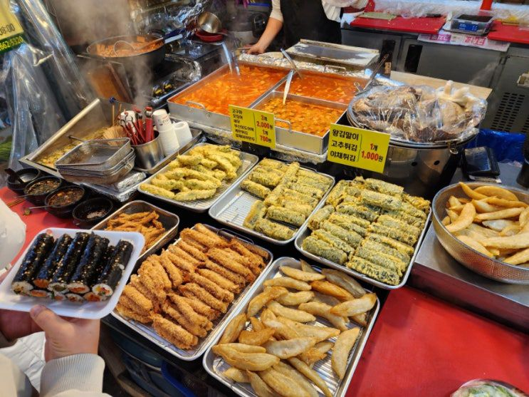
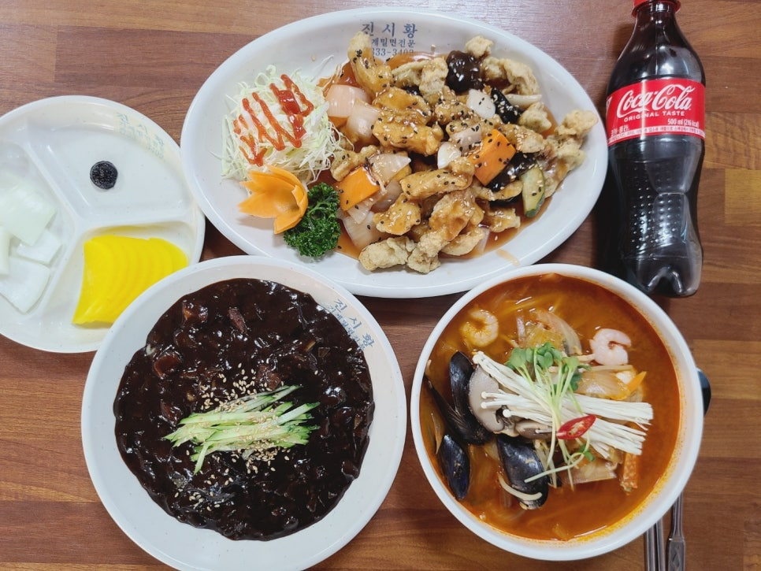

# Tasty Korean dishes :yum:

Let me quote my boyfriend: “Isn’t it crazy that I didn’t have a single overlapping dish during a 30-day trip in Korea?” Yes, you read that right. Koreans love good food, and one of the best ways to experience the culture is through it. Eating is very important to us.

(Please don’t ask why.) There are four main types of “Korean dishes”: [Korean](#korean-dishes), [Chinese](#chinese-dishes), [Japanese](#japanese-dishes), [Western](#western-dishes). The cultural background behind this is debatable, but I won’t get into it :wink:.

## Korean dishes
- Bunsik 분식 (Snack dishes): easy snack-type dishes, usually in very small shops, cost ~15,000–20,000 won (~15 CHF) for two people.
    - Search 분식집, from wherever you are, you will find it anywhere
    - 떡볶이 tteokbokki, 어묵 fish cake, 만두 mandu (dumplings), 김밥 gimbap, 라면 ramyeon, 튀김 (deep-fried stuff: gim-mari, veggies, sweet potato, squid, shrimp, etc.), 순대 sundae (black pudding) + steamed pork liver, 핫도그 corn dog

/// caption
Photo credit: [link](https://m.blog.naver.com/tasha81/222998635095)
///

- Hanjeongsik 한정식 (course korean meal): course Korean meal, a fancy version of typical Korean dining culture. Koreans always eat rice, soup, and main and side dishes. The number of dishes and cost vary depending on the restaurant: 10–15+ dishes, 50,000–300,000+ won (30–160+ CHF) per meal per person.
    - Search 한정식집, from wherever you are, you may not find it everywhere

/// caption
Photo credit: [link](https://external-preview.redd.it/hanjeongsik-a-full-course-korean-meal-with-a-whole-array-of-v0-rUF24G76tQQXeHbmuBEIVaoc2AcdagkKBYd8_Tby2Ho.jpg?width=1080&crop=smart&auto=webp&s=63a3a97e3c300ac9a0c4ab0a85db3efb494f8f77)
///

- Hoejeongsik 회정식 (Sashimi course meal): Sashimi (raw fish) course meal. It can be expensive.
    - Search 횟집, you won’t find it everywhere. Seoul and major big cities have many high-quality places; otherwise, try it when visiting seaside cities.

/// caption
Photo credit: [link](https://cdn.mygoyang.com/news/photo/202404/79022_112801_4910.jpg)
///

- Fried Chicken and Beer 치맥 /Chi-Mac/: Literally, the deep-fried chicken + beer combination is really popular in Korea. You can find many different fried chicken flavors, so it’s worth trying. Chi-Mac places are everywhere.

/// caption
Photo credit: [link](https://i.namu.wiki/i/zPkdsHY66COU-dfrfuMYMcmCxucYdCMbo-8ahVcyllEJxDUgifRoB7kr6p6gHtwkRCYMkEW1AxzzmqsqClbViVn0nQC2E8ZIzJzll9f-13KbSyRNJege-cC5AON-Gm64ZEmr4o8b70pK48ejOcsILxy309FmBtB2xst_6Be37v8.webp)
///

- Other Korean dishes I really like, you will be able to find them anywhere, search the names, price range 10,000 ~ 20,000 won.
    - Bulgogi 불고기: soy sauce seasoned beef
    - Jeyukbokeum 제육볶음: spicy stir-fried pork
    - Kimchi soup 김치찌개: Kimchi, pork/fish, and tofu soup
    - Bibimbap 비빔밥: mixed rice with vegetables, meat, egg, and chili paste
    - Haemul-pajeon 해물파전: seafood and green onion pancake
    - K-bbq: grilled meat with Korean side dishes and salad wraps
        - Samgyeopsal 삼겹살: grilled pork belly
        - Galbi 갈비: marinated grilled beef short ribs
    - Doenjang-jjigae 된장찌개: soybean paste stew with tofu and vegetables
    - Sundubu-jjigae 순두부찌개: soft tofu spicy stew
    - Japchae 잡채: stir-fried glass noodles with vegetables and meat
    - Dakgalbi 닭갈비: spicy stir-fried chicken with vegetables
    - Samgyetang 삼계탕: ginseng chicken soup
    - Bossam 보쌈: boiled pork slices served with kimchi and wraps

## Chinese dishes

We call restaurants that sell Koreanized Chinese dishes “Chinese restaurants 중국집.” Given the wide variety of Chinese cuisine, the term can feel a bit reductive, but these dishes are quite unique to Korea. You won’t find the exact same versions in China, some overlap exists, but not all. These days, there are also authentic Chinese restaurants in Korea (e.g., Haidilao for huoguo—Chinese hot pot).

- Jjajangmyeon 짜장면: wheat noodles topped with thick black bean sauce, usually with pork and vegetables
- Jjamppong 짬뽕: spicy seafood noodle soup with vegetables and chili oil
- Tangsuyuk 탕수육: sweet and sour deep-fried pork (closer to authentic Chinese cuisine!)
- If you’re traveling as a pair, order all three dishes and share them. It should cost under/around 50,000 won in total.

/// caption
Top - tangsuyuk 탕수육, bottom left - jjajangmyeon 짜장면, bottom right - jjamppong 짬뽕 ; Photo credit: [link](https://postfiles.pstatic.net/MjAyMzAxMjdfNzEg/MDAxNjc0ODA5Mzc5NzAz.aKtR-nzU9hyNP2okNz1UWmvvBVAp0arF5hyX8olD054g.3TNIcFRLSXu6stB5szPRs1zhulhuX2w38oZ13NkpeHog.JPEG.danielfood2379/KakaoTalk_20221031_204014400_08.jpg?type=w966)
///

## Japanese dishes

Unlike Koreanized Chinese dishes, Japanese dishes are closer to, or almost the same as, authentic ones (Japanese friends might disagree :sweat_smile:). Most Japanese restaurants in Korea are quite decent, including ramen, izakaya, tempura, and sushi places. Here are some dishes Koreans love:

- Donkatsu/Gyukatsu: deep-fried pork/beef cutlet
- Udon/Ramen: warm noodle soup
- Gyudon: beef rice bowl
- Soba: Japanese-style cold noodles

## Western dishes

Another category of Koreanized dishes. Like Koreanized pasta/pizza/risotto. Sorry mio amico, my dear italian friends :heart_hands:. Let's call them italian fusion dishes :heart_hands::it:.

One of the fusion Italian restaurants I really love is [Italyguksi 이태리국시](https://www.instagram.com/italyguksi). I agree it looks more Korean than Italian, but trust me, it tastes great! Most normal “Italian” restaurants in Korea are somewhat Koreanized :wink:.

/// caption
Photo credit: [Italyguksi](https://search.pstatic.net/common/?src=https%3A%2F%2Fldb-phinf.pstatic.net%2F20241123_167%2F1732373783043BgEJP_JPEG%2FDSC02437.jpg)
///

Also, Koreanized pizzas are pretty good. Let me quote my Italian friend: “It’s really good, but just don’t call it pizza :pinched_fingers:.”

/// caption
Potato pizza + sweet potato mousse + cheese dough; photo credit: [x: @YakBbap](https://x.com/YakBbap/status/1997160408063570108/photo/1)
///
