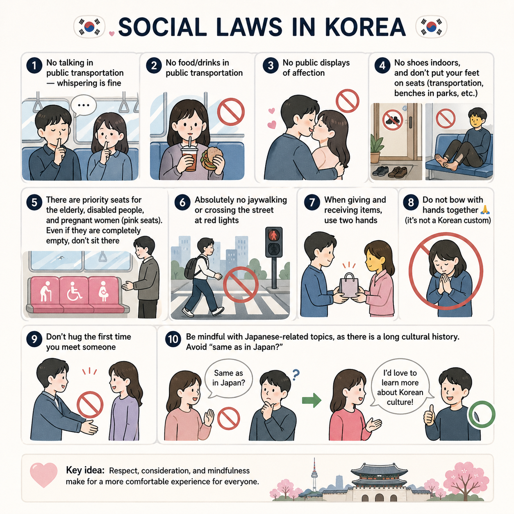
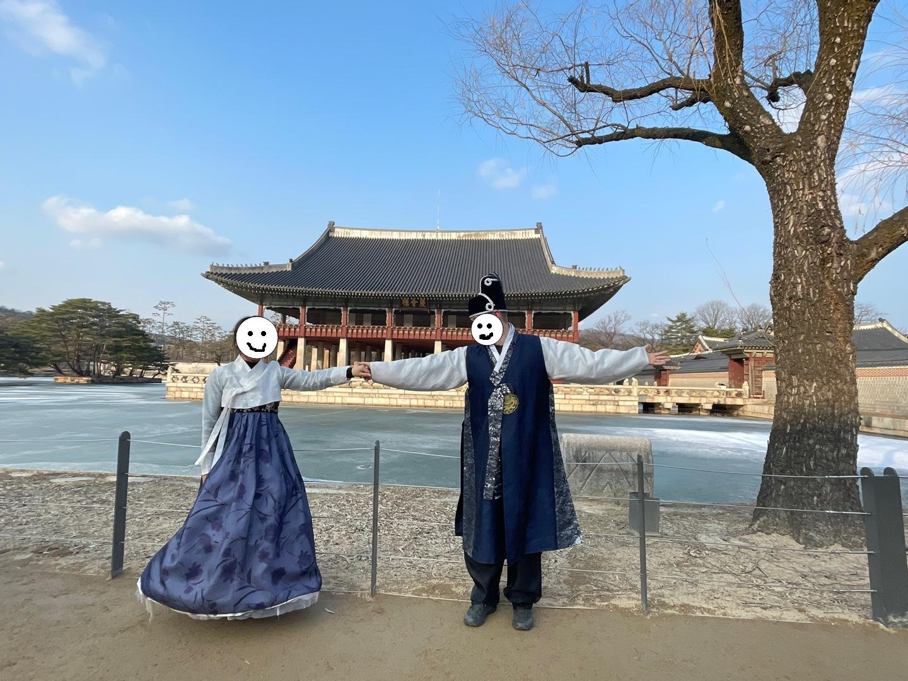
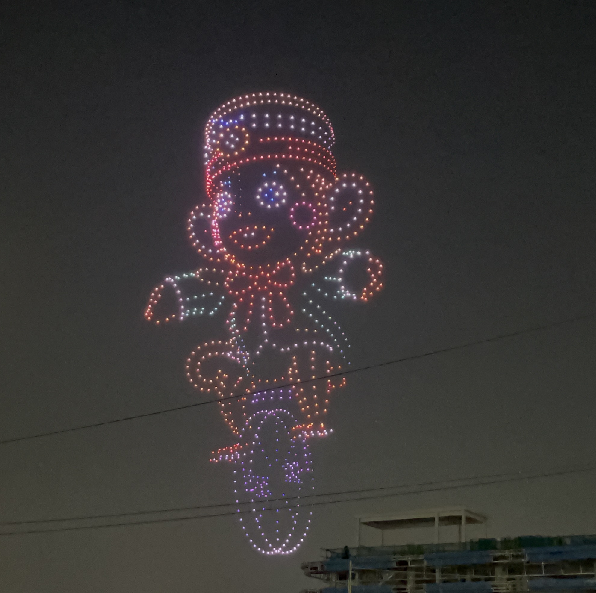
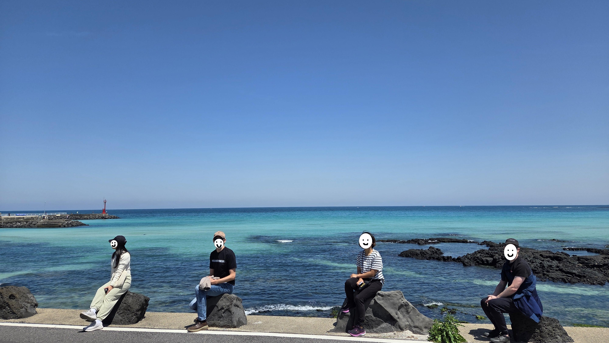

# Oh-hyeon's Guide to Korea :kr:

A disclaimer first: this is just my personal take, treat it as suggestions and do whatever you want. I’m not responsible for anything.

## Must-have Apps
- Maps: [Naver Map](https://map.naver.com) or [Kakao Map](https://map.kakao.com) (in theory, Google Maps works now, but it’s still more precise to use Korean native apps)
- Taxi/cabs: Kakao Taxi - [app store](https://apps.apple.com/us/app/kakao-t/id981110422), [google play](https://play.google.com/store/apps/details?id=com.kakao.taxi&pli=1) (there could be others)
- Train: [Korail](https://www.korail.com/global/eng/main)

## Social laws in Korea

/// caption
Photo credit ChatGPT, generated on 27th Apr 2026
///

??? more in details

    - No talking in public transportation (bus, train, metro, etc.),  whispering is fine
    - No food/drinks in public transportation
    - No public displays of affection
    - No shoes indoors, and don’t put your feet on seats (transportation, benches in parks, etc.)
    - There are priority seats for the elderly, disabled people, and pregnant women (pink seats). Even if they are completely empty, don’t sit there
    - Absolutely no jaywalking or crossing the street at red lights, you may get fined
    - When giving and receiving items, use two hands
    - Do not bow with hands together 🙏🏻 (it’s not a Korean custom)
    - Don’t hug the first time you meet someone
    - Be mindful with Japanese-related topics, as there is a long cultural history. Avoid “same as in Japan?”

## Transportation
- Within Seoul: Naver Map or Kakao Map is extremely precise; either bus or metro should be straightforward to use
- To get out of Seoul: there are trains and buses. For trains, you should book ahead of time, especially on weekends. Use the Korail app. Buses are slightly trickier, but there are often more options. Naver Map and Kakao Map should guide you well
- Outside Seoul (countryside cities): don’t bother with public transport, just take Kakao Taxi (or similar). Taxis in Korea are very affordable
- Renting cars is not a bad option outside Seoul. In Seoul, don’t even think about it

## Must-dos in Seoul
- Hanbok & palace tour in Seoul, see more detailed instruction here: [click Gwanghwamun Gate marker :round_pushpin:](https://www.google.com/maps/d/u/1/viewer?mid=1aXdDZf-FTRRDirfKPxF0pWuOLgO8N8g&ll=37.57587719999998%2C126.97681209999999&z=20)

/// caption
@Gyeongbokgung palace, 2024
///

- Seochon street trip [(next to the palace area)](https://www.google.com/maps/d/u/1/viewer?mid=1aXdDZf-FTRRDirfKPxF0pWuOLgO8N8g&ll=37.57430329999999%2C126.9844135&z=20)
- [Namdaemun Market](https://www.google.com/maps/d/u/1/viewer?mid=1aXdDZf-FTRRDirfKPxF0pWuOLgO8N8g&ll=37.55933653561093%2C126.97765913341604&z=18) for random items

/// caption
Photo credit: [link](https://www.theseoulguide.com/wp-content/uploads/2021/11/namdaemun_market_seoul_korea-800x500.jpg)
///

- Traditional markets (food / homely goods / souvenirs), there are many, not only Gwangjang Market (also Gwangmyeong Market)
- TikTok-trendy pop-up stores [(Seongsu)](https://www.google.com/maps/d/u/1/viewer?mid=1aXdDZf-FTRRDirfKPxF0pWuOLgO8N8g&ll=37.54183839999999%2C127.05646359999999&z=18), personally not a big fan, but they can be mind-blowing. Maybe avoid weekends
- Drone-show! Search online, you may find something happening during your stay

/// caption
@Seoul Hangang drone show 2025
///

## Interesting cultural experiences
- Jjimjilbang: bath & spa, as a child it was always our weekend activity :smile:

/// caption
Photo credit: [link](https://cdn.shopify.com/s/files/1/0552/3665/7344/files/Benefits_of_Jjimjilbang_1024x1024.jpg?v=1718375009)
///

- Facial / hair care: search facial and hair care online. It feels really good and affordable (150,000 won (85 CHF) - 300,000 won (170 CHF)). Sadly, there are a lot of “scams,” in the sense that they keep charging you more during the treatment. I’m not great at dealing with this either, but one useful trick is to ask upfront how much it will cost in total.
- Hiking: 70% of the Korean peninsula is covered with mountains, but the hiking culture is very different from Switzerland, for example
    - Follow the trails (definitely no off-road)
    - Gimbap + cup noodles are a must
    - In more countryside hiking areas (e.g., Gyeryong Mountain), you’ll find many restaurants along the paths, especially at the foot of the mountains. They all sell similar dishes: spicy or mild chicken stew/soup (dakbokkeumtang 닭볶음탕 or samgyetang 삼계탕), green onion pancakes 파전, and Korean rice wine (makgeolli 막걸리)
    - Koreans often go hiking not just to hike, but to enjoy these dishes

/// caption
Typical hiking activity, photo credit: [link](https://korean.visitseoul.net/comm/getImage?srvcId=MEDIA&parentSn=51828&fileTy=MEDIA&fileNo=2)
///

- K-BBQ (cook it yourself): find a not-so-fancy place where you cook your own meat. I believe you can do it :)
- Arcade 오락실: you can find arcade in most of the major shopping streets

/// caption
Arcade, photo credit: [link](https://roamingsonaa.com/wp-content/uploads/2019/01/neon-kpop-ddr-korean-arcade-scaled.jpeg)
///

## Nice additions
- Jeju Island: if you are staying more than 2 weeks, definitely worth visiting. The most touristic place in Korea, even for Koreans. But you’ll understand why once you’re there. A beautiful volcanic island with unique nature and cultural experiences (haenyeo: free divers).

- Jeonju / Gyeongju: historical Korean cities. Jeonju was a former capital of Later Baekje (후백제). Gyeongju was the capital of Silla for ~1000 years. Many historical attractions, plus some more low-key Gen Z spots if you go ~30 minutes away from the main tourist areas.

## Food reommendations -> [Tasty Korean dishes](food.md)

## Additional suggestions :palms_up_together:
<iframe
  src="https://www.google.com/maps/d/u/1/embed?mid=1aXdDZf-FTRRDirfKPxF0pWuOLgO8N8g&ehbc=2E312F"
  width="100%"
  height="500"
  style="border:0; border-radius:8px;"
  allowfullscreen=""
  loading="lazy"
  referrerpolicy="no-referrer-when-downgrade">
</iframe>
