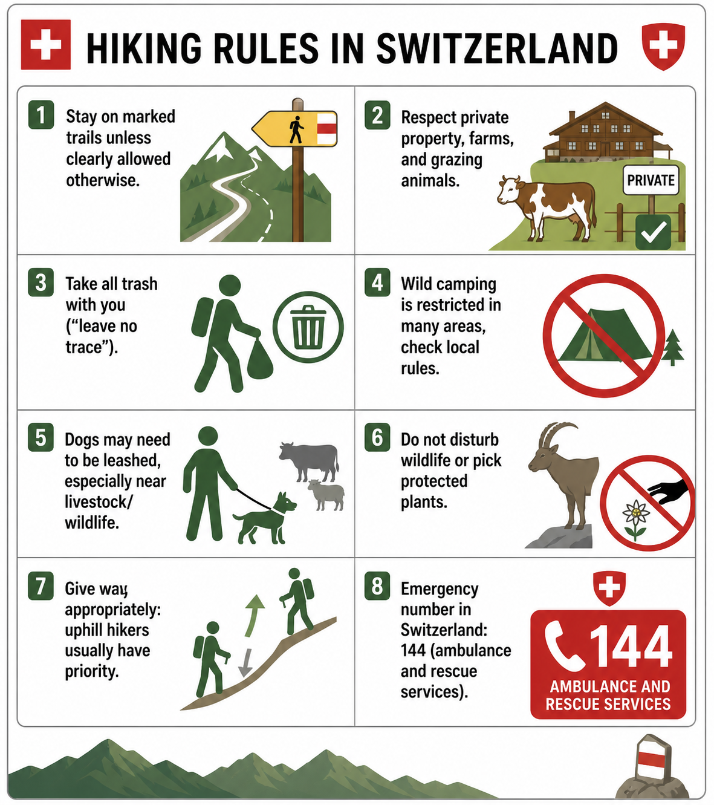
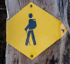
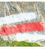
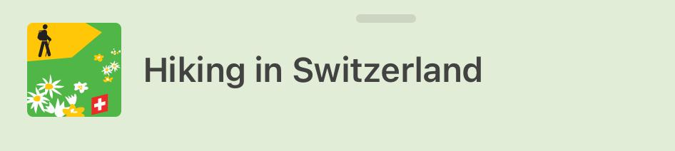
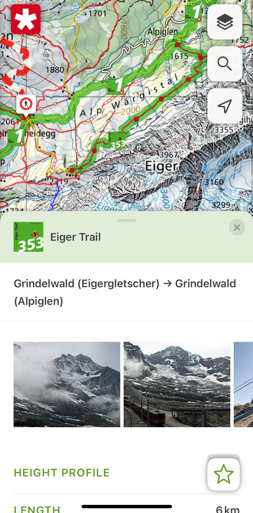
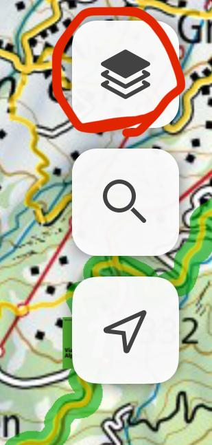
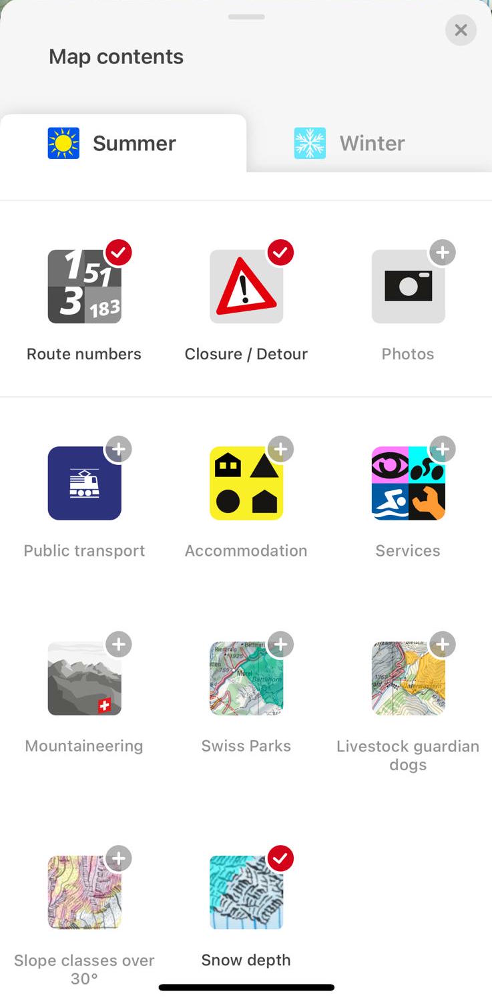
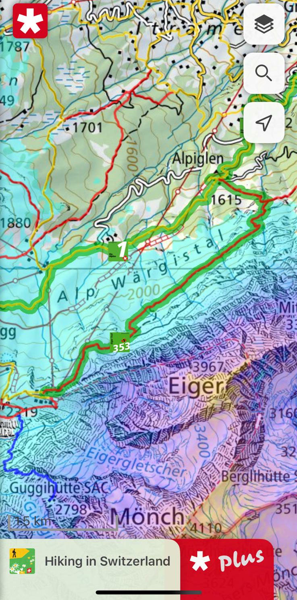

# Oh-hyeon's Swiss Guide :ch:

A disclaimer first: this is just my personal take, treat it as suggestions and do whatever you want. I’m not responsible for anything.

You decided to travel to Switzerland, so I’ll assume you expect beautiful nature. First of all, come in summer (mid-July to early September), unless you’re visiting in winter (December to March) for skiing. Thanks to (?) climate change, this year’s spring (April 2026) has been very sunny and beautiful, but it’s usually quite rainy in spring and autumn.

My preferred way of traveling in Switzerland is to take public transportation :train2: on a sunny day :sun_with_face: and then go for a hike :mountain:.

- Public transportation :train2: in Switzerland is more than just great. You can get almost anywhere, and most of the time, it’s on time. Google Maps works fine, but the [SBB app](#must-have-apps) is better.
- Mountain weather :partly_sunny: changes quickly, so check [MeteoSwiss or MeteoBlue](#must-have-apps).
- There are also many nationally maintained hiking trails :hiking_boot:, check them out on the [SwitzerlandMobility app](#must-have-apps).

## Must-have Apps

  

    
    Public transportation: SBB
  

  

    

      
      
    

    Weather: Meteo Swiss or Meteo Blue
  

  

    
    Official hiking paths: Switzerland Mobility
  

## Hiking rules

/// caption
Photo credit ChatGPT, generated on 1st May 2026
///

??? more in details

    - Stay on marked trails unless clearly allowed otherwise.
    - Respect private property, farms, and grazing animals.
    - Take all trash with you (“leave no trace”).
    - Wild camping is restricted in many areas, check local rules.
    - Dogs may need to be leashed, especially near livestock/wildlife.
    - Do not disturb wildlife or pick protected plants.
    - Give way appropriately: uphill hikers usually have priority.
    - Emergency number in Switzerland: 144 (ambulance and rescue services).

## How to pick a hiking trail

There are hiking trails in almost every spot in Switzerland. Here are some signs you will see, and more [in details](https://schweizmobil.ch/en/planning-wl?origin=hike#categories-of-difficulty-signalisation-wl):

| Sign | Difficulty | Notes |
|---|---|---|
| Yellow diamond  | Easy | Mostly family-friendly |
| White-red-white strap  | Intermediate | Some exposed sections |
| White-blue-white strap  | Alpine | Self-securing gear may be needed; hike at your own risk |
| No marking (off-road) | — | Avoid |

/// caption
Photo credit, and more: [link](https://schweizmobil.ch/en/planning-wl?origin=hike#categories-of-difficulty-signalisation-wl)
///

Let's say, you visited the `top of Europe`, Junfraujoch, spent a fortune, and now want to do a hike nearby. Here’s how to check whether a trail is suitable:

1. Open the Switzerland Mobility app, and select the `Hiking in Switzerland` tab.

  
2. Look for <strong>green highlighted hiking trails</strong>, these are well-maintained. Select a trail (here: the Eiger Trail). Read the description carefully and check whether it matches your fitness level. If you are new to mountain hiking, I'd avoid trails with more than 1200 m elevation gain or longer than 6 hours. But ultimately, it's your call.

  

  
3. If you are not prepared for snow, check conditions first. Tap the <strong>layers button</strong> in the top-right corner and enable the <strong>snow depth layer</strong>.

  

    
    
  

  
4. The snow depth is now overlaid on the map. Uh-oh, the Eiger Trail is still covered in snow. Time to pick another trail!

  

Please keep in mind that snow line could be around 2000m even in mid July :mountain_snow:.
